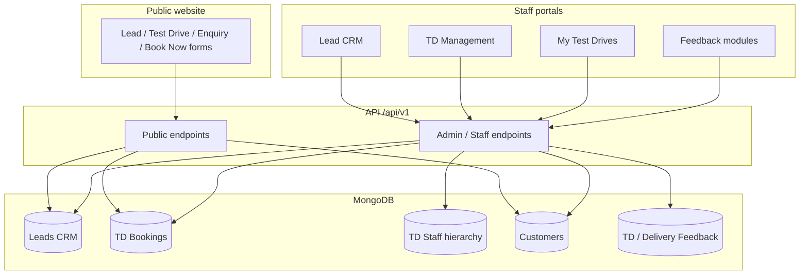
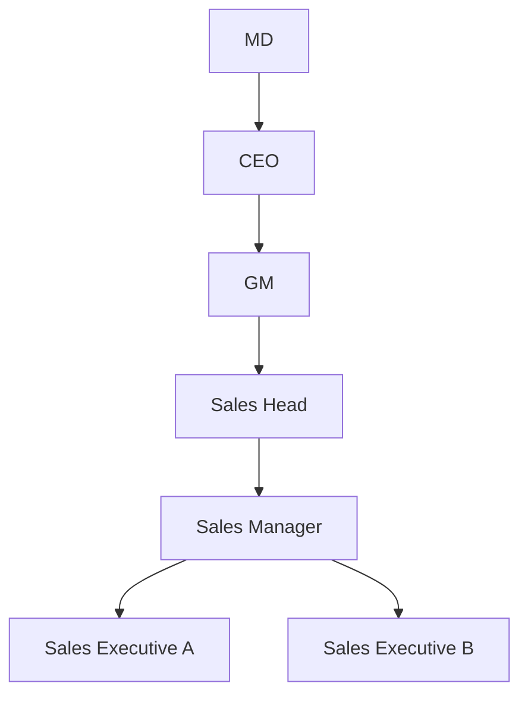
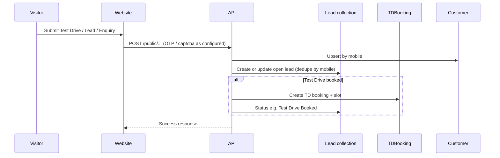
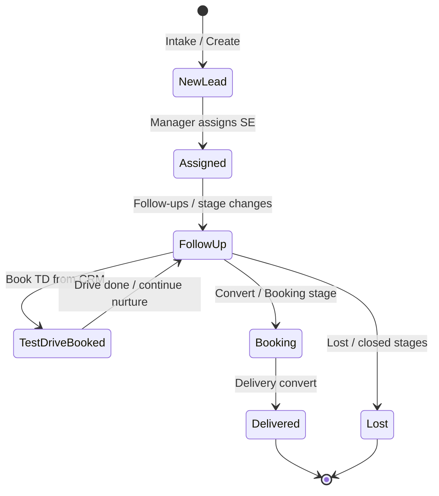
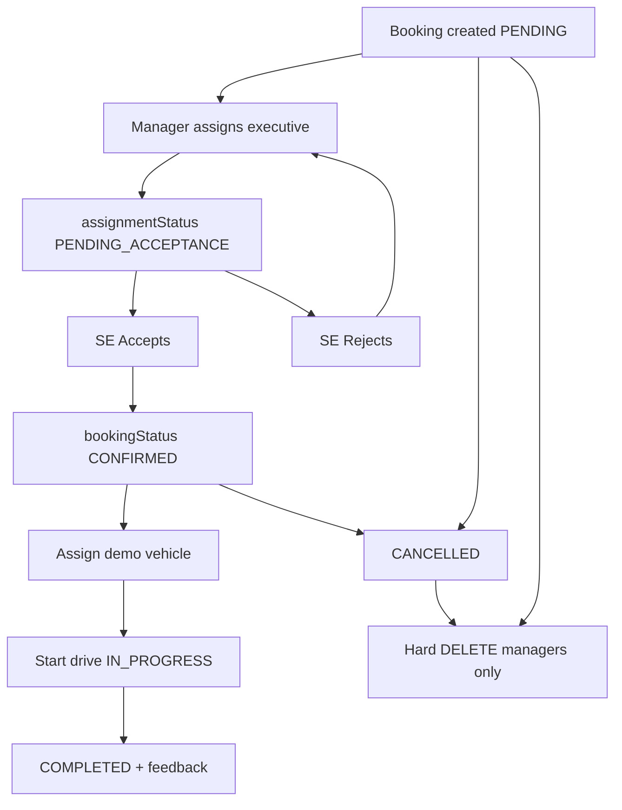
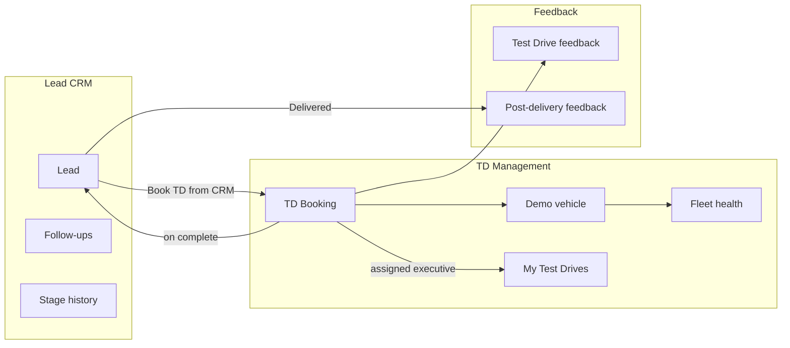

# Patliputra VinFast — Data Flow Documentation

**For client / stakeholder review**  
**Primary API:** `https://apivnfast.patliputragroup.com/api/v1`  
**Public site:** `https://patliputravinfast.in`  
**Document date:** 30 July 2026  

This document explains how data moves through the Patliputra VinFast system and how the main modules relate to each other.

---

## 1. System overview

| Layer | Technology | Location |
|--------|------------|----------|
| Public website + Admin / Staff / Customer portals | Vite + React SPA | `career-section-nanak/` |
| Backend API | Express + MongoDB | Root `src/` + `server.js` |

---

## 2. Staff roles and visibility

Hierarchy is stored on **`TDStaff.reportsTo`** (not a separate `managerId` field).

| Auth role | Typical designation | What they see |
|-----------|---------------------|---------------|
| `executive` | Sales Executive | Own assigned leads and TD bookings only |
| `manager` | Sales Manager, Sales Head, Branch Manager | Self + everyone in their `reportsTo` subtree |
| `superadmin` / unrestricted | MD, CEO, GM, CRE | Full dealership |

**Sales Manager filter behaviour (CRM + TD):**

- Default list = own leads/bookings **plus** reporting Sales Executives.
- Staff dropdown = self + team only (`GET /admin/td/users/assignable`).
- Choosing a specific SE (or “Me”) sends `assignedTo` / `assignedExecutive` and intersects with the team scope.

---

## 3. Public website → CRM / TD intake

**Typical sources**

| Source | Creates |
|--------|---------|
| Website test drive form | `TDBooking` + CRM `Lead` |
| Book Now / lead forms | CRM `Lead` |
| Enquiry form | Enquiry + often mirrored CRM lead |
| Meta ads ingest | Meta lead CRM pipeline |
| Staff “Add lead” / walk-in TD booking | Lead and/or booking from admin |

Lead IDs use Patliputra conventions (`PVLEAD*` / opportunity ids) via intake utilities.

---

## 4. Lead CRM lifecycle

**Admin screens:** Lead CRM (`/admin/crm/leads`), TD Leads (`/admin/td/leads`) — both use CRM lead APIs.

**Assignment**

1. Manager (or ACL user with `crm_leads:assign`) selects staff from assignable list.
2. Lead stores `assignedTo` (TDStaff id) + `assignedToEmail`.
3. Stage history and follow-ups attach to the lead.
4. Completing a TD can sync lead status / assignment from the booking executive.

---

## 5. Test Drive booking lifecycle

**Admin screens:** TD Bookings (`/admin/td/bookings`), My Test Drives (`/admin/td/my-bookings`).

| Action | Who | API (prefix `/api/v1`) |
|--------|-----|-------------------------|
| List bookings | Manager / scoped staff | `GET /admin/td/bookings` |
| My bookings | Assigned executive (+ team for managers) | `GET /admin/td/bookings/my` |
| Assign executive | Manager | `PATCH /admin/td/bookings/:id/assign-executive` |
| Accept | Assigned SE (or manager) | `PATCH /admin/td/bookings/:id/accept-assignment` |
| Reject | Assigned SE (or manager) | `PATCH /admin/td/bookings/:id/reject-assignment` |
| Cancel | Permitted roles | `PATCH /admin/td/bookings/:id/cancel` |
| Delete permanently | Manager / admin | `DELETE /admin/td/bookings/:id` |

**Cancel vs Delete**

- **Cancel** keeps the record with status `CANCELLED` (history preserved).
- **Delete** removes the row from MongoDB (managers only; blocked while `IN_PROGRESS`).

---

## 6. Relationship between modules

| Module | Primary data | Depends on |
|--------|--------------|------------|
| Lead CRM | `Lead` | `TDStaff` (assignment) |
| TD Bookings | `TDBooking` | Customer, vehicle, assigned executive |
| TD Leads | Same CRM `Lead` APIs | Same as Lead CRM |
| My Test Drives | Bookings assigned to logged-in staff | Assignment accept/reject |
| Fleet / vehicles | Demo fleet inventory | Used when starting a drive |
| Feedback | Form submissions keyed to booking / delivery | Completed TD or delivered lead |
| User Master | `TDStaff` + `reportsTo` | Gates visibility and assignable lists |
| Calendar | Aggregated events | Bookings, follow-ups, approvals |

---

## 7. Customer portal

Customers authenticate with WhatsApp OTP and can view/manage their own bookings (including reschedule with preferred slots where enabled). Staff still own assignment, vehicle allocation, and drive completion in the admin portal.

---

## 8. Feedback modules

| Module | Path | Trigger |
|--------|------|---------|
| Test Drive Feedback | Public QR / form + `/admin/feedback/test-drive` | After TD completion |
| Post-delivery Feedback | Public form + `/admin/feedback/post-delivery` | After delivery conversion |

Feedback records are stored separately from CRM stage history but may reference booking or customer ids.

---

## 9. Key API map (admin)

Base: `/api/v1/admin`

| Area | Examples |
|------|----------|
| Auth | `POST /auth/login`, `POST /auth/staff-login`, `GET /auth/me` |
| CRM leads | `GET/POST /td/leads`, assign, stage, follow-ups |
| TD bookings | `GET /td/bookings`, assign-executive, accept-assignment, cancel, `DELETE /td/bookings/:id` |
| Staff | `GET /td/users`, `GET /td/users/assignable` (team-scoped for SM) |
| Vehicles / fleet | `/td/vehicles`, `/td/fleet-health`, `/stock` |
| Feedback | Feedback submission list endpoints under admin feedback modules |
| Dashboard | `/dashboard/stats`, `/dashboard/calendar`, `/my-dashboard` |

Public intake lives under `/api/v1/public/...` (leads, test-drives, enquiries, OTP, site config).

---

## 10. Notifications (side effects)

When configured (SMTP / WhatsApp), the notification engine can emit:

- Booking created / confirmed  
- Assignment rejection escalations  
- Customer OTP and journey messages  

Mail will not leave the server until SMTP env vars are set (see `MOM_IMPLEMENTATION_DOCUMENTATION.md`).

---

## 11. End-to-end example: website TD → SE acceptance

1. Visitor books a test drive on the website → `TDBooking` (`PENDING`) + CRM lead.  
2. Sales Manager opens **TD Bookings**, filters team if needed, assigns a Sales Executive.  
3. `assignmentStatus` becomes `PENDING_ACCEPTANCE`.  
4. SE opens **My Test Drives** and taps **Accept**.  
5. Booking becomes `CONFIRMED` / `ACCEPTED`; manager assigns a demo vehicle.  
6. SE starts drive → `IN_PROGRESS` → completes with odometer / feedback.  
7. CRM lead status updates from completion sync; optional TD Feedback form is available.

---

*End of data flow documentation — Patliputra VinFast.*
