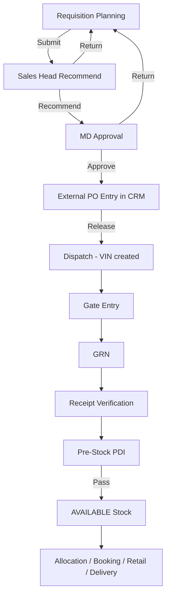

# Patliputra VinFast — Purchase Order & Procurement Flow

**Version:** 1.0 (aligned with SRS + current CRM implementation)  
**Audience:** Operations, purchase, warehouse, admin, developers  
**API base:** `/api/v1/admin/stock/pipeline`  
**Admin UI base:** `/admin/stock/...`

---

## 1. Purpose

This module tracks **vehicle procurement from internal demand approval through chassis receipt and saleable stock**.

Important distinction:

| System | Role |
|--------|------|
| **External OEM / ERP software** | Raises the real supplier purchase order, invoice, and payment |
| **Patliputra CRM** | Records external PO reference, lines, document link, and tracks every **VIN** through gate → GRN → PDI → stock |

The CRM **does not** post accounting entries. It stores references and operational data for traceability.

---

## 2. Masters — where field data comes from

Before any PO step, these masters supply dropdowns and defaults:

| Master | Admin screen | Used in | Key fields pulled |
|--------|--------------|---------|-------------------|
| **Vehicle catalogue** | TD Management → Model Master | Requisition, PO lines | Model, variant |
| **Colour options** | Static catalogue helper | Requisition, PO lines | Exterior colour |
| **Vendor Master** | Stock → Vendor Master | PO | Supplier name, GSTIN, default payment terms |
| **Stock config** | Stock → Stock Config | PO types, payment terms, PDI checklists | PO type, payment terms |
| **Staff / User Master** | User Master | All approvals | `requestedBy`, `recommendedBy`, `approvedBy`, `createdBy` |
| **Branch / location** | Stock config / branches | Requisition, PO | `branchId`, `receivingLocation`, `deliveryLocation` |

Every requisition and PO line uses the **same vehicle catalogue** so model / variant / colour stay consistent downstream (dispatch, GRN match, stock register).

---

## 3. End-to-end flow (start → saleable stock)



---

## 4. Step-by-step: what to do, where, and where data goes

### Step 1 — Requisition Planning

| Item | Detail |
|------|--------|
| **Who** | Purchase Planner |
| **Screen** | Stock → **Requisition Planning** (`/admin/stock/requisitions`) |
| **Permission** | `stock_requisition`: view, create, update |
| **Action** | Create requisition → fill model/variant/colour/qty → Submit |

**User enters:**

- Model, variant, colour (from catalogue)
- Quantity, priority (NORMAL / URGENT)
- Needed-by date, receiving location
- Purpose, justification, indicative amount, remarks

**API:**

- `POST /requisitions` — create (status `DRAFT`)
- `PUT /requisitions/:id` — edit draft / returned / submitted
- `POST /requisitions/:id/submit` — submit for Sales Head

**Data written → MongoDB collection `stockrequisitions`:**

| Field | Source |
|-------|--------|
| `requisitionNo` | Auto counter |
| `requestedBy` | Logged-in staff |
| `model`, `variant`, `colour`, `qty` | Form + catalogue |
| `receivingLocation`, `purpose`, `justification`, `indicativeAmount` | Form |
| `status` | `DRAFT` → `SUBMITTED` |
| `approvalHistory[]` | Append on submit |

---

### Step 2 — Sales Head recommendation

| Item | Detail |
|------|--------|
| **Who** | Sales Head |
| **Screen** | Same — Requisition Planning list |
| **Permission** | `stock_requisition`: approve |
| **Actions** | **Recommend** · **Return** (comment required) · **Reject** (reason required) |

**API:**

- `POST /requisitions/:id/recommend` → status `PENDING_MD`
- `POST /requisitions/:id/return` → status `RETURNED`, `version++`
- `POST /requisitions/:id/reject` → status `REJECTED`

**Data updated on `stockrequisitions`:**

| Field | When |
|-------|------|
| `status` | SUBMITTED → PENDING_MD / RETURNED / REJECTED |
| `recommendedBy`, `recommendedAt` | On recommend |
| `approvalHistory[]` | Every action + remarks |
| `version` | Incremented on return (planner revises and resubmits) |

**Rule:** Requester cannot recommend/approve/reject their own requisition (except super admin).

---

### Step 3 — MD approval

| Item | Detail |
|------|--------|
| **Who** | MD / authorised delegate |
| **Screen** | Requisition Planning list |
| **Permission** | `stock_requisition`: approve |
| **Action** | **MD Approve** (or Return / Reject) |

**API:** `POST /requisitions/:id/approve` (only from `PENDING_MD`)

**Data updated:**

| Field | Value |
|-------|-------|
| `status` | `APPROVED` |
| `approvedBy`, `approvedAt` | Current MD user |
| `approvalHistory[]` | APPROVE entry |

Requisition is now eligible for external PO entry in CRM.

---

### Step 4 — External PO entry (CRM purchase order record)

| Item | Detail |
|------|--------|
| **Who** | Purchase team |
| **Screen** | Stock → **Purchase Orders** (`/admin/stock/purchase-orders`) |
| **Permission** | `stock_po`: create, update |
| **Recommended path** | **From requisitions** — select approved requisition(s) |
| **Alternative** | **New PO** — manual multi-line entry |

**User enters (external PO section):**

- External PO number & date (from OEM / ERP)
- Source system (Manual, SAP, OEM portal, etc.)
- Signed PO document URL (PDF link)
- Vendor (from Vendor Master)
- PO type, payment terms
- Lines: model / variant / colour / qty / pricing

**API:**

- `POST /purchase-orders/from-requisitions` — **preferred** (links requisitions)
- `POST /purchase-orders` — manual PO
- `PUT /purchase-orders/:id` — edit while DRAFT / SUBMITTED / REJECTED

**Data written → MongoDB collection `purchaseorders`:**

| Field | Source |
|-------|--------|
| `poNumber` | Auto internal CRM number |
| `externalPoNumber`, `externalPoDate`, `sourceSystem`, `externalDocumentUrl` | External system reference |
| `supplierId`, `supplier` | Vendor Master |
| `requisitionIds[]` | Selected requisitions |
| `lines[]` | From requisition spec or manual entry |
| `lines[].requisitionId` | Link back to requisition line |
| `lines[].qty`, `dispatchedQty`, `receivedQty` | Ordered / shipped / received counters |
| `status` | `DRAFT` |
| `createdBy` | Purchase user |

**Data updated on `stockrequisitions` (when created from requisitions):**

| Field | Value |
|-------|-------|
| `orderedQty` | Increased by PO line qty |
| `linkedPoId`, `linkedPoIds[]` | CRM PO reference |
| `status` | `PART_ORDERED` or `ORDERED` |

---

### Step 5 — Internal PO approval & release

| Item | Detail |
|------|--------|
| **Who** | Purchase / leadership (internal CRM approval) |
| **Screen** | Purchase Orders list |
| **Permission** | `stock_po`: update, approve |

**Actions & API:**

| Action | API | New PO status |
|--------|-----|---------------|
| Submit for approval | `POST /purchase-orders/:id/submit` | `SUBMITTED` |
| Approve | `POST /purchase-orders/:id/approve` | `APPROVED` |
| Reject | `POST /purchase-orders/:id/reject` | `REJECTED` |
| Release to plant | `POST /purchase-orders/:id/release` | `RELEASED` (PO locked) |
| Cancel | `POST /purchase-orders/:id/cancel` | `CANCELLED` |

**Data updated on `purchaseorders`:**

- `status`, `locked`, `releasedAt`, `raisedAt`
- `approvalHistory[]` on each transition

**After release:** PO is locked — lines cannot be edited. Dispatch can begin.

---

### Step 6 — Dispatch (plant shipment / VIN creation)

| Item | Detail |
|------|--------|
| **Who** | Purchase / logistics |
| **Screen** | Stock → **Dispatch & Transit** (`/admin/stock/dispatches`) |
| **Permission** | `stock_dispatch`: create |
| **Precondition** | PO status = `RELEASED` or `PART_SUPPLIED` |

**User enters per shipment:**

- PO reference
- OEM invoice no & date, transporter, LR, truck, driver
- **One row per VIN** with model/variant/colour (must match PO line)

**API:** `POST /dispatches`

**Data written:**

**Collection `dispatches`:**

| Field | Value |
|-------|-------|
| `dispatchNumber` | Auto |
| `purchaseOrderId`, `poNumber` | From PO |
| `items[]` | VIN list + `poLineId`, config match |
| `status` | `IN_TRANSIT` |

**Collection `vehiclestocks` — one document per VIN (created here):**

| Field | Value |
|-------|-------|
| `vinNo` | Unique chassis number |
| `model`, `variant`, `colour` | From dispatch item |
| `vehicleStatus` | `IN_TRANSIT` |
| `purchaseOrderId` | Parent PO |
| `dispatchId` | This dispatch |
| `stockId` | Auto internal stock ID |

**Updated on `purchaseorders.lines[]`:**

- `dispatchedQty` += 1 per VIN
- PO status → `PART_SUPPLIED` when all lines fully dispatched

---

### Step 7 — Gate entry (security arrival)

| Item | Detail |
|------|--------|
| **Who** | Security / gate team |
| **Screen** | Stock → **Gate Entry** (`/admin/stock/gate-entry`) |
| **Permission** | `stock_gate`: create |
| **Precondition** | Dispatch status = `IN_TRANSIT` |

**User enters:**

- Dispatch (dropdown of in-transit shipments)
- Truck number (must match dispatch)
- Seal number, arrival datetime
- **Arrival photo** (required — uploaded to Cloudinary)

**API:** `POST /gate-entries` (multipart)

**Data written → collection `gateentries`:**

| Field | Value |
|-------|-------|
| `gateEntryNo` | Auto |
| `dispatchId` | Selected dispatch |
| `arrivalDatetime`, `truckNumber`, `sealNumber` | Form |
| `arrivalPhotoUrl` | Cloudinary URL |
| `status` | `ARRIVED` |

**Data updated:**

| Collection | Change |
|------------|--------|
| `dispatches` | `status` → `ARRIVED` |
| `vehiclestocks` | Each VIN on dispatch → `vehicleStatus` = `ARRIVED` |

---

### Step 8 — GRN (goods receipt note)

| Item | Detail |
|------|--------|
| **Who** | Warehouse |
| **Screen** | Stock → **GRN** (`/admin/stock/grn`) |
| **Permission** | `stock_grn`: create |
| **Precondition** | Gate entry exists, no GRN yet for that gate |

**User enters:**

- Gate entry
- Invoice number, GRN datetime
- Select VINs received + odometer per chassis

**API:** `POST /grns`

**Data written → collection `grns`:**

| Field | Value |
|-------|-------|
| `grnNumber` | Auto |
| `gateEntryId`, `dispatchId`, `purchaseOrderId`, `poNumber` | Linked upstream |
| `items[]` | VIN, match result, odometer, photos, exceptions |
| `receivedQty`, `expectedQty`, `status` | RECEIVED or EXCEPTION |

**Data updated:**

| Collection | Change |
|------------|--------|
| `vehiclestocks` | VIN → `RECEIVED` (or `EXCEPTION` if mismatch) |
| `vehiclestocks` | `grnId` set |
| `gateentries` | `status` → `GRN_IN_PROGRESS` |
| `purchaseorders.lines[]` | `receivedQty` += 1 per accepted VIN |
| `purchaseorders` | Auto `PART_SUPPLIED` or `CLOSED` when all lines fully received |

**Config match rule:** Physical model/variant/colour compared to PO line. Mismatch → exception — **not saleable**.

---

### Step 9 — Receipt verification

| Item | Detail |
|------|--------|
| **Who** | Warehouse |
| **Screen** | Stock → **Receipt Verification** (`/admin/stock/receipt`) |
| **Permission** | `stock_receipt`: create |

**API:** `GET /receipts/queue` · `POST /receipts`

**Data written → collection `receiptverifications`**

**Data updated on `vehiclestocks`:**

- `vehicleStatus` → `RECEIPT_ACCEPTED` → eligible for PDI queue

---

### Step 10 — Pre-stock PDI

| Item | Detail |
|------|--------|
| **Who** | PDI inspector |
| **Screen** | Stock → **Pre-Stock PDI** (`/admin/stock/pre-stock-pdi`) |
| **Permission** | `stock_pdi`: create |

**API:** `GET /pdi/queue` · `POST /pdi/:id/pre-stock`

**Data written → collection `stockpdis`**

**Data updated on `vehiclestocks`:**

| PDI result | Vehicle status |
|------------|----------------|
| Pass | `AVAILABLE` — **saleable stock** |
| Fail / hold | `PDI_FAIL`, `PDI_HOLD`, or `HOLD` — not saleable |

---

### Step 11 — Downstream (after saleable stock)

| Step | Screen | Collection / link |
|------|--------|-------------------|
| View stock | Vehicle Stock / Stock Dashboard | `vehiclestocks` |
| Customer booking | Lead CRM | `leads` (no auto VIN reserve) |
| Allocate VIN | Vehicle Orders / Delivery | `vehicleallocations` → `vehiclestocks.reserved` |
| Retail invoice | Retail & Invoice | `vehiclestocks` → `INVOICED` |
| Delivery | Delivery & Handover | `vehiclestocks` → `DELIVERED` |

---

## 5. Data relationship map

```text
StockRequisition (demand)
    │
    │ requisitionIds / lines[].requisitionId
    ▼
PurchaseOrder (CRM PO + external PO ref)
    │
    │ purchaseOrderId
    ▼
Dispatch (shipment header + VIN list)
    │
    ├──► VehicleStock (one per VIN — permanent chassis record)
    │
    │ dispatchId
    ▼
GateEntry (truck arrival + photo)
    │
    │ gateEntryId
    ▼
Grn (warehouse receipt per VIN)
    │
    ├──► updates PO.lines[].receivedQty
    │
    ▼
ReceiptVerification
    ▼
StockPdi (pre-stock inspection)
    ▼
VehicleStock.vehicleStatus = AVAILABLE
    ▼
Allocation → Retail → Delivery
```

---

## 6. Status reference

### Requisition statuses

| Status | Meaning |
|--------|---------|
| `DRAFT` | Planner editing |
| `SUBMITTED` | Waiting Sales Head |
| `PENDING_MD` | Recommended; waiting MD |
| `APPROVED` | Cleared for PO entry |
| `PART_ORDERED` | Some qty on PO(s) |
| `ORDERED` | Full qty on PO(s) |
| `RETURNED` | Sent back to planner |
| `REJECTED` | Declined |
| `CLOSED` / `CANCELLED` | Terminal |

### Purchase order statuses

| Status | Meaning |
|--------|---------|
| `DRAFT` | Editable CRM PO |
| `SUBMITTED` | Internal approval pending |
| `APPROVED` | Approved; not yet released |
| `RELEASED` | Locked; dispatch allowed |
| `PART_SUPPLIED` | Some VINs dispatched and/or received |
| `CLOSED` | Fully fulfilled / manually closed |
| `REJECTED` / `CANCELLED` | Terminal |

### Vehicle (chassis) statuses through pipeline

```text
IN_TRANSIT → ARRIVED → RECEIVED → RECEIPT_ACCEPTED → PDI_PENDING → AVAILABLE
                              ↘ EXCEPTION / HOLD (not saleable until cleared)
```

---

## 7. Quantity balance rules (PO lines)

Each PO line tracks three counters:

| Counter | Increased when | Meaning |
|---------|----------------|---------|
| `qty` | PO create / edit | Total ordered |
| `dispatchedQty` | Dispatch create (per VIN) | Left plant / in transit |
| `receivedQty` | GRN create (per accepted VIN) | Physically received at warehouse |

**Balance checks:**

- Cannot dispatch more VINs than `qty - dispatchedQty`
- Partial dispatch and partial GRN are supported
- PO auto-closes when all lines: `receivedQty >= qty`

---

## 8. Permissions (User Master modules)

| Module key | Label in UI | Typical actions |
|------------|-------------|-----------------|
| `stock_requisition` | Requisition Planning | view, create, update, delete, approve |
| `stock_po` | Purchase Orders | view, create, update, delete, approve |
| `stock_dispatch` | Dispatch & Transit | view, create, update, delete |
| `stock_gate` | Gate Entry | view, create, update, delete |
| `stock_grn` | GRN | view, create, update, delete |
| `stock_receipt` | Receipt Verification | view, create |
| `stock_pdi` | Pre-Stock PDI | view, create |
| `stock_vendors` | Vendor Master | view, create, update, delete |
| `stock_config` | Stock Config | view, update |
| `vehicle_stock` | Vehicle Stock | view, update |
| `stock_delivery` | Super-module | Grants broad pipeline access for delivery roles |

---

## 9. API quick reference

All routes under: **`/api/v1/admin/stock/pipeline`**

### Requisitions

| Method | Path | Purpose |
|--------|------|---------|
| GET | `/requisitions` | List |
| POST | `/requisitions` | Create |
| PUT | `/requisitions/:id` | Update |
| POST | `/requisitions/:id/submit` | Submit |
| POST | `/requisitions/:id/recommend` | Sales Head recommend |
| POST | `/requisitions/:id/return` | Return with comment |
| POST | `/requisitions/:id/reject` | Reject |
| POST | `/requisitions/:id/approve` | MD approve |
| DELETE | `/requisitions/:id` | Delete draft only |

### Purchase orders

| Method | Path | Purpose |
|--------|------|---------|
| GET | `/purchase-orders` | List |
| POST | `/purchase-orders` | Manual create |
| POST | `/purchase-orders/from-requisitions` | Create from approved requisitions |
| PUT | `/purchase-orders/:id` | Update draft/submitted/rejected |
| POST | `/purchase-orders/:id/submit` | Submit |
| POST | `/purchase-orders/:id/approve` | Approve |
| POST | `/purchase-orders/:id/reject` | Reject |
| POST | `/purchase-orders/:id/release` | Release (lock) |
| POST | `/purchase-orders/:id/close` | Close |
| POST | `/purchase-orders/:id/cancel` | Cancel |
| DELETE | `/purchase-orders/:id` | Delete draft only |

### Dispatch → GRN

| Method | Path | Purpose |
|--------|------|---------|
| POST | `/dispatches` | Create dispatch + VIN stock records |
| POST | `/gate-entries` | Record arrival (multipart photo) |
| POST | `/grns` | Record goods receipt |
| POST | `/receipts` | Receipt verification |
| POST | `/pdi/:id/pre-stock` | Pre-stock PDI |

---

## 10. Role playbook (who does what where)

| Role | Steps | Screens |
|------|-------|---------|
| **Purchase Planner** | Create & submit requisition; record external PO; create dispatch | Requisitions, PO, Dispatch |
| **Sales Head** | Recommend / return requisitions | Requisitions |
| **MD** | Approve / return / reject requisitions | Requisitions |
| **Security** | Gate entry only | Gate Entry |
| **Warehouse** | GRN, receipt verification | GRN, Receipt |
| **PDI team** | Pre-stock inspection | Pre-Stock PDI |
| **Sales** | Allocate available VIN to booking | Vehicle Orders, Vehicle Stock |
| **Super Admin** | Masters, permissions, corrections | User Master, Vendor, Config |

---

## 11. Production test checklist

Use this sequence to verify the full pipeline in a test environment:

1. [ ] Create requisition (model/variant/colour from catalogue) → Submit  
2. [ ] Sales Head → Recommend  
3. [ ] MD → Approve  
4. [ ] PO → **From requisitions** → enter external PO number + document URL → Submit → Approve → **Release**  
5. [ ] Dispatch → enter VIN(s) → confirm `vehiclestocks` created as `IN_TRANSIT`  
6. [ ] Gate Entry → photo + truck → VINs → `ARRIVED`  
7. [ ] GRN → select VINs → confirm PO `receivedQty` updated  
8. [ ] Receipt verification → PDI queue  
9. [ ] Pre-stock PDI pass → VIN shows **AVAILABLE** on Vehicle Stock  
10. [ ] Allocate VIN to booking → retail → delivery  

---

## 12. Out of scope (SRS — future modules)

Not part of the current PO implementation:

- Purchase Plan / Demand dashboard (forecast-driven planning)
- Formal quotation PDF module from leads
- Loaner fleet and VinFast claim workflow
- Automated shortage / delay alerts
- Direct API sync with external ERP (manual document entry today)

---

## 13. Related files (developers)

| Layer | Path |
|-------|------|
| Requisition model | `src/models/StockRequisition.js` |
| PO model | `src/models/PurchaseOrder.js` |
| Dispatch / Gate / GRN models | `src/models/Dispatch.js`, `GateEntry.js`, `Grn.js` |
| Chassis register | `src/models/VehicleStock.js` |
| Requisition controller | `src/controllers/stockRequisitionController.js` |
| Pipeline controller | `src/controllers/stockPipelineController.js` |
| Routes | `src/routes/admin/stockPipeline.js` |
| Frontend API | `career-section-nanak/src/lib/stockPipelineApi.ts` |
| Admin screens | `AdminStockRequisitions.tsx`, `AdminPurchaseOrders.tsx`, `AdminDispatches.tsx`, `AdminGateEntry.tsx`, `AdminGrn.tsx` |

---

*Document maintained for Patliputra VinFast CRM. Update when PO workflow or SRS changes.*
